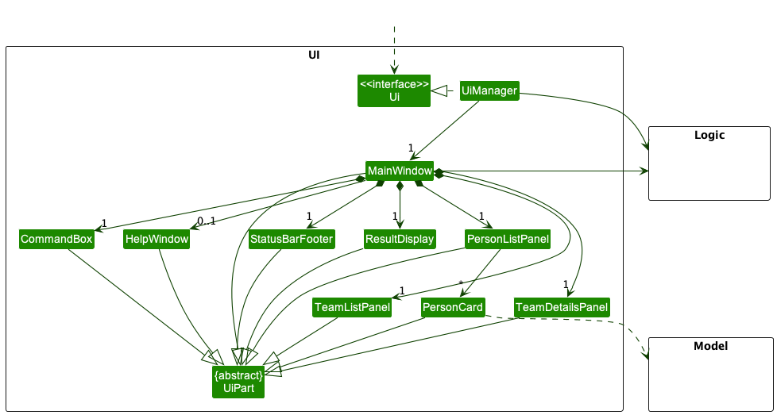
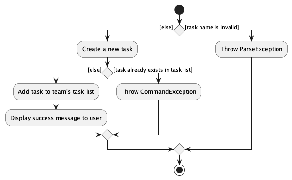
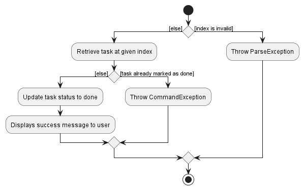
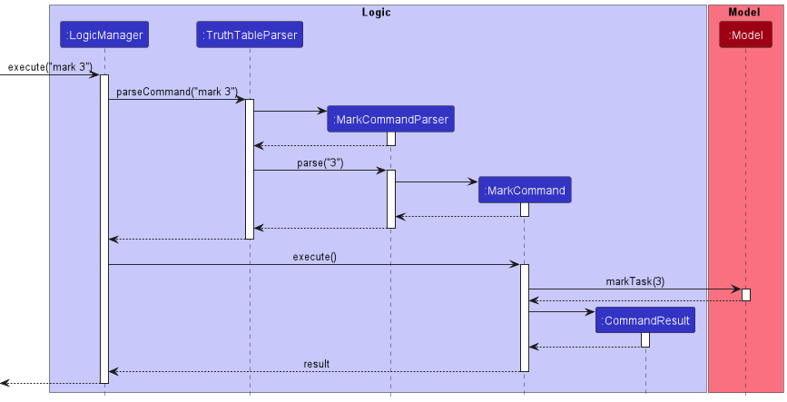
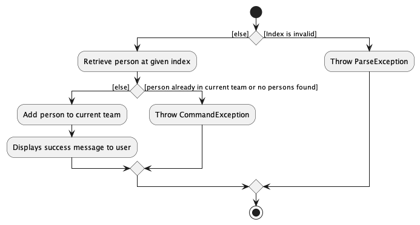
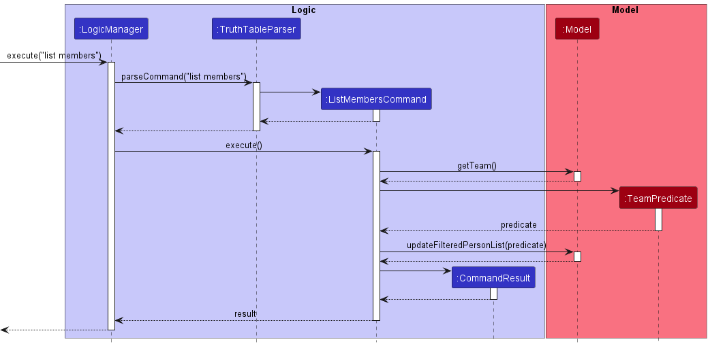
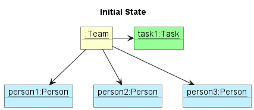
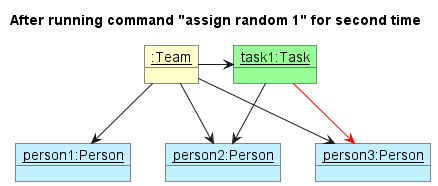

- Table of Contents 
  {:toc}

---

TruthTable is a **desktop app for managing software engineering teams, optimized for use via a Command Line Interface**
(CLI) while still having the benefits of a Graphical User Interface (GUI). This guide will help you get familiar with TruthTable and understand the implementations of some of our features.

## **Acknowledgements**

- Our application is based on the [AddressBook-Level3](https://se-education.org/addressbook-level3/) project created by the [SE-EDU initiative](https://se-education.org/).
- Our application makes use of the [Picocli](https://picocli.info/) library for parsing and executing commands.
- Our application makes use [JavaFX](https://openjfx.io/) of as the UI framework.
- Our application makes use [Jackson](https://github.com/FasterXML/jackson) of as the JSON parser.
- Our application makes use of [JUnit5](https://junit.org/junit5/) as the testing framework.

---

## **Setting up, getting started**

If this is your first time contributing to our application, please take a look at the guide [_Setting up and getting started_](SettingUp.md).

---

## **Design**

:bulb: **Tip:** The `.puml` files used to create diagrams in this document can be found in
the [diagrams](https://github.com/se-edu/addressbook-level3/tree/master/docs/diagrams/) folder. Refer to the [_PlantUML
Tutorial_ at se-edu/guides](https://se-education.org/guides/tutorials/plantUml.html) to learn how to create and edit
diagrams.

### Architecture

The **_Architecture Diagram_** given above explains the high-level design of the App.

Given below is a quick overview of main components and how they interact with each other.

**Main components of the architecture**

**`Main`** has two classes
called [`Main`](https://github.com/se-edu/addressbook-level3/tree/master/src/main/java/seedu/address/Main.java)
and [`MainApp`](https://github.com/se-edu/addressbook-level3/tree/master/src/main/java/seedu/address/MainApp.java). It
is responsible for,

- At app launch: Initializes the components in the correct sequence, and connects them up with each other.
- At shut down: Shuts down the components and invokes cleanup methods where necessary.

[**`Commons`**](#common-classes) represents a collection of classes used by multiple other components.

The rest of the App consists of four components.

- [**`UI`**](#ui-component): The UI of the App.
- [**`Logic`**](#logic-component): The command executor.
- [**`Model`**](#model-component): Holds the data of the App in memory.
- [**`Storage`**](#storage-component): Reads data from, and writes data to, the hard disk.

**How the architecture components interact with each other**

The _Sequence Diagram_ below shows how the components interact with each other for the scenario where the user issues
the command `delete 1`.

Each of the four main components (also shown in the diagram above),

- defines its _API_ in an `interface` with the same name as the Component.
- implements its functionality using a concrete `{Component Name}Manager` class (which follows the corresponding
  API `interface` mentioned in the previous point).

For example, the `Logic` component defines its API in the `Logic.java` interface and implements its functionality using
the `LogicManager.java` class which follows the `Logic` interface. Other components interact with a given component
through its interface rather than the concrete class (reason: to prevent outside component's being coupled to the
implementation of a component), as illustrated in the (partial) class diagram below.

The sections below give more details of each component.

### UI component

The **API** of this component is specified
in [`Ui.java`](https://github.com/se-edu/addressbook-level3/tree/master/src/main/java/seedu/address/ui/Ui.java)

The UI consists of a `MainWindow` that is made up of parts e.g.`CommandBox`, `ResultDisplay`, `PersonListPanel`
, `StatusBarFooter` etc. All these, including the `MainWindow`, inherit from the abstract `UiPart` class which captures
the commonalities between classes that represent parts of the visible GUI.

The `UI` component uses the JavaFx UI framework. The layout of these UI parts are defined in matching `.fxml` files that
are in the `src/main/resources/view` folder. For example, the layout of
the [`MainWindow`](https://github.com/se-edu/addressbook-level3/tree/master/src/main/java/seedu/address/ui/MainWindow.java)
is specified
in [`MainWindow.fxml`](https://github.com/se-edu/addressbook-level3/tree/master/src/main/resources/view/MainWindow.fxml)

The `UI` component,

- executes user commands using the `Logic` component.
- listens for changes to `Model` data so that the UI can be updated with the modified data.
- keeps a reference to the `Logic` component, because the `UI` relies on the `Logic` to execute commands.
- depends on some classes in the `Model` component, as it displays `Person` object residing in the `Model`.

### Logic component

**API** : [`Logic.java`](https://github.com/se-edu/addressbook-level3/tree/master/src/main/java/seedu/address/logic/Logic.java)

Here's a (partial) class diagram of the `Logic` component:

How the `Logic` component works:

1. When `Logic` is called upon to execute a command, it uses the `TruthTableParser` class to parse the user command.
1. This results in a `Command` object (more precisely, an object of one of its subclasses e.g., `AddCommand`) which is
   executed by the `LogicManager`.
1. The command can communicate with the `Model` when it is executed (e.g. to add a person).
1. The result of the command execution is encapsulated as a `CommandResult` object which is returned from `Logic`.

The Sequence Diagram below illustrates the interactions within the `Logic` component for the `execute("delete 1")` API
call.

:information_source: **Note:** The lifeline for `DeleteCommandParser` should end at the destroy marker (X) but due to a limitation of PlantUML, the lifeline reaches the end of diagram.

Here are the other classes in `Logic` (omitted from the class diagram above) that are used for parsing a user command:

How the parsing works:

- When called upon to parse a user command, the `TruthTableParser` class creates an `XYZCommandParser` (`XYZ` is a
  placeholder for the specific command name e.g., `AddCommandParser`) which uses the other classes shown above to parse
  the user command and create a `XYZCommand` object (e.g., `AddCommand`) which the `TruthTableParser` returns back as
  a `Command` object.
- All `XYZCommandParser` classes (e.g., `AddCommandParser`, `DeleteCommandParser`, ...) inherit from the `Parser`
  interface so that they can be treated similarly where possible e.g, during testing.

### Model component

**API** : [`Model.java`](https://github.com/se-edu/addressbook-level3/tree/master/src/main/java/seedu/address/model/Model.java)

The `Model` component,

- stores the TruthTable data i.e., all `Person` objects (which are contained in a `UniquePersonList` object).
- stores the currently 'selected' `Person` objects (e.g., results of a search query) as a separate _filtered_ list which
  is exposed to outsiders as an unmodifiable `ObservableList<Person>` that can be 'observed' e.g. the UI can be bound to
  this list so that the UI automatically updates when the data in the list change.
- stores a `UserPref` object that represents the user’s preferences. This is exposed to the outside as
  a `ReadOnlyUserPref` objects.
- does not depend on any of the other three components (as the `Model` represents data entities of the domain, they
  should make sense on their own without depending on other components)

:information_source: **Note:** An alternative (arguably, a more OOP) model is given below. It has a `Tag` list in the `TruthTable`, which `Person` references. This allows `TruthTable` to only require one `Tag` object per unique tag, instead of each `Person` needing their own `Tag` objects. 

### Storage component

**API** : [`Storage.java`](https://github.com/se-edu/addressbook-level3/tree/master/src/main/java/seedu/address/storage/Storage.java)

The `Storage` component,

- can save both TruthTable data and user preference data in json format, and read them back into corresponding
  objects.
- inherits from both `TruthTableStorage` and `UserPrefStorage`, which means it can be treated as either one (if only
  the functionality of only one is needed).
- depends on some classes in the `Model` component (because the `Storage` component's job is to save/retrieve objects
  that belong to the `Model`)

### Common classes

Classes used by multiple components are in the `seedu.addressbook.commons` package.

---

## **Implementation**

This section describes some noteworthy details on how certain features are implemented.

### Add a Team Feature

#### Implementation

The `add team` feature allows users to add a specific team to their list of teams.

The `TruthTable` object is designed to have a list of teams called `UniqueTeamList`.

The following is an example of how a team is added:

Precondition: Team name is valid (it cannot be empty or begin with a space)
1. User keys in the add team command with the name of the team to be added (e.g. `add_team CS2103`)
2. A team is created added to the team list.

If the team name provided is invalid, an appropriate exception will be thrown and the respective error message will be
shown to the user.

The following activity diagram summarises the action taken when the `AddTeamCommand` is executed.

### Add a Task Feature

#### Implementation

The `add task` feature allows users to add a specific task to their team's task list. The following is an example of how
a task is added:

Precondition: Task name is valid (it cannot be empty or begin with a space).

1. User keys in the add task command with the name of the task to be added (e.g. `add_task Complete Resume`)
2. A task is created and added to the current team's task list.

If the task name provided is invalid, an appropriate exception will be thrown and the respective error message will be
shown to the user.

The following activity diagram summarises the action taken when `AddTaskCommand` is executed:

_Activity diagram of adding a task_

#### Design considerations:

- **Alternative 1**: Store a global list of tasks and each task keeps track of which team it was created for through an
  attribute.
    - Pros: A single list of tasks makes it easier to list all the tasks associated with all teams.
    - Cons: Does not accurately model how teams actually work in terms of task distribution.
- **Alternative 2**: Each team stores a list of tasks that are associated with it.
    - Pros: Better modularisation since a team contains all the information related to itelf, including the tasks
      associated with it.
    - Cons: It is slightly more complicated to find the list of all tasks associated with a person if the person belongs
      to multiple teams since there multiple task lists.

We decided to use alternative 2 because it scales better as the number of teams increase.

### Mark Task as Done Feature

#### Implementation

The `mark` feature allows users to mark a specific task as done.

The following is an example usage scenario of how a task is marked as done:

Precondition: Task index provided is valid.

1. User keys in mark command with the specific index of the task. (e.g. `mark 1`)
2. The first task in the task list is marked as done.

If any of the following occurs:

1. Index given is negative
2. Index given is out of range (i.e. There are fewer tasks than the specified index)
3. Task has already been marked as done

Then, an appropriate exception will be thrown and the respective error message will be shown to the user.

The following activity diagram summarizes the action taken when `MarkCommand` is executed:

_Activity diagram of marking task as done_

In the `Logic` component, once `LogicManager#execute()` is called, `TruthTableParser` and `MarkCommandParser` parses the
index of the task in the user input, and generates a `MarkCommand` object. `LogicManager` then executes the
`MarkCommand` object, which sets which task in the team is to be set as done in the `Model` component. A
`CommandResult` is generated with `isCompleted` boolean value being true.

The sequence diagram of the Mark command is shown below:

_Sequence diagram of marking tasks as done_

### Add Member to Team Feature

#### Implementation

The add member to team feature allows users to add a user to the current team using the person's name.

The following is an example usage scenario of how a member is added to a team:

Precondition: Name provided is valid and the current working team is set to the team that the member should be added to.

1. User keys in `add_member` command with the person's name.
2. The person with the specified name in the list is added to the team.

If any of the following occurs:

1. Name is not alphanumeric
2. Name provided does not match any persons' name
3. Person with specified name is already in the team

Then, an appropriate exception will be thrown and the respective error message will be shown to the user.

The following activity diagram summarizes the action taken when the `AddMemberCommand` is executed:

_Activity diagram of adding member to team_

In the `Logic` component, once `LogicManager#execute()` is called, `TruthTableParser` and `AddMemberCommandParser`
parses the index of the person in the user input, and generates a `AddMemberCommand` object. `LogicManager` then
executes the `AddMemberCommand` object, which adds the person to the current team in the `Model` component. A
`CommandResult` is generated with a message indicating the person being added to the team.

### List Members Feature

#### Implementation

The list members feature allows users to view the members in their current team.

The list members command works similar to list command, which updates the `PersonListPanel` and shows the members in the
current team.

Currently, `PersonListPanel` displays all persons that satisfy some `Predicate`, which is stored in the
`filteredPersons` in `ModelManager`.

Whenever list members command is called, the `Predicate` for `filteredPersons` is then updated and the corresponding
members of the team is shown.

The following sequence diagram illustrates what happens within the `Logic` component when the list members command is
executed:

### Randomly Assign Task Feature
#### Implementation

The randomly assign task feature allows users to assign a `Task` (within a particular `Team`) to a random team member (
represented as a `Person` object) within the team, who are not already assigned to that `Task`.

This functionality is exposed to the user through the `assign_task_rand` command, and the logic is executed
in `RandomlyAssignTaskCommand#execute()`.

Given below is an example usage scenario and the state of the `Team` object at each step.

Step 1. The user launches the application and adds multiple users into the current team, as well as at least one task.
The `Team` will contain multiple `Person` objects (representing team members).

Step 2. The user executes the command `assign_task_rand 1` to assign the first (and only) `Task` randomly to any team
member. As none of the team members have been added, all of them are candidates for random assignment. One of them will
be randomly assigned the task.

Step 3. The user may want to assign a second team member to the task, hence executing `assign_task_rand 1` again. The
team member who has previously been allocated will not be considered. Similar to above, one more team member will be
randomly allocated the task.

:information_source: **Note:** If there are no team members left to allocate (e.g. all team members have already been assigned to this task), an error will be thrown.

The following activity diagram summarizes the flow of `RandomlyAssignTaskCommand#execute()`.

_Activity diagram of randomly assigning_

--------------------------------------------------------------------------------------------------------------------

## **Documentation, logging, testing, configuration, dev-ops**

- [Documentation guide](Documentation.md)
- [Testing guide](Testing.md)
- [Logging guide](Logging.md)
- [Configuration guide](Configuration.md)
- [DevOps guide](DevOps.md)

---

## **Appendix: Requirements**

### Product scope

**Target user profile**:

- Tech-savvy university student leading teams in software engineering modules to build software projects
- Having trouble keeping track of the team’s progress and delegating tasks effectively
- Student who prefers CLI to GUI for productivity’s sake
- Desperate for a single source of truth on who is doing what and by when

**Value proposition**:

- Users can collate different project-related information (e.g. Github project PRs, issues, links to Zoom meetings, and
  Google Docs)
- Users can visualise teams’ progress easily
- Users can delegate tasks to their teammates conveniently
- CLI interface to manage project tasks much more quickly than GUI based products

### User stories

Priorities: High (must have) - `* * *`, Medium (nice to have) - `* *`, Low (unlikely to have) - `*`

| Priority | As a ...              | I want to ...                                                                            | So that I can...                                                                                     |
| -------- | --------------------- | ---------------------------------------------------------------------------------------- | ---------------------------------------------------------------------------------------------------- |
| `* * *`  | New User              | See usage instructions                                                                   | Refer to instructions when I forget how to use the App                                               |
| `* * *`  | Team Leader           | View completed tasks                                                                     | Track the status of the project                                                                      |
| `* * *`  | Team Leader           | Add new tasks                                                                            | Track things my team needs to do                                                                     |
| `* * *`  | Team Leader           | Add team members with their contact information                                          | Keep track of my team members and contact them with their preferred mode of communication            |
| `* * *`  | Team Leader           | View tasks based on contact’s name/email                                                 | Keep track of each person’s tasks                                                                    |
| `* * *`  | Team Leader           | Assign deadlines to tasks                                                                | Track whether we are meeting deadlines for all tasks or not                                          |
| `* * *`  | Team Leader           | Create multiple stages of completion for a task (e.g. in progress, in code review, done) | See the progress of each task at a glance                                                            |
| `* * *`  | Team Leader           | Delete tasks                                                                             | Remove tasks that are no longer required to be completed or have been added on mistake               |
| `* * *`  | Team Leader           | Delete members                                                                           | Remove information of members who are no longer working on my project                                |
| `* *`    | Team Leader           | Modify existing tasks                                                                    | Update project requirements and track things to do                                                   |
| `* *`    | Team Leader           | Assign tasks to team members                                                             | Distribute workload evenly and keep everyone accountable                                             |
| `* *`    | Team Leader           | Edit the contact information of my team members                                          | Correct it if I accidentally added the wrong number/email                                            |
| `* *`    | Team Leader           | Give priority to tasks                                                                   | Better plan which tasks are to be assigned to whom and when                                          |
| `* *`    | Engineering Team Lead | Store links that lead me to an issue on the repo                                         | Easily view the diff, progress, etc.                                                                 |
| `* *`    | Team Leader           | View links to future Zoom meetings                                                       | Avoid opening Zoom separately and can directly join the meeting from the application                 |
| `* *`    | Team Leader           | Add subtasks                                                                             | Break down tasks into manageable parts                                                               |
| `* *`    | Team Leader           | View a summary of how many tasks each member has been assigned                           | Assign tasks to the members more equally, based on how occupied they might be                        |
| `* *`    | Team Leader           | Add recurring tasks such as weekly meetings                                              | Assign a recurring tasks once instead of having to schedule it every occurrence                      |
| `*`      | Team Leader           | View past meeting minutes                                                                | Refer to what has been discussed before                                                              |
| `*`      | Team Leader           | View past meetings                                                                       | Remember which date we completed each meeting                                                        |
| `*`      | Team Leader           | View upcoming meetings                                                                   | Plan for upcoming meetings                                                                           |
| `*`      | Team Leader           | Modify upcoming meetings                                                                 | Reschedule future meetings when the need arises                                                      |
| `*`      | Team Leader           | Copy team member’s email                                                                 | Easily send an email to remind him/her to do their task                                              |
| `*`      | Team Leader           | Have 2 kinds of deadlines - soft and hard                                                | Let my team members finish the task by the soft deadline and I can review/merge by the hard deadline |
| `*`      | Team Leader           | Receive reminders when a deadline is due                                                 | Ensure tasks are completed on time                                                                   |
| `*`      | Team Leader           | Randomly assign a task to any team member                                                | Assign tasks easily if nobody has any preference                                                     |

### Use cases

(For all use cases below, the **System** is the `TruthTable` and the **Actor** is the `user`, unless specified
otherwise)

**Use case: UC01 - Add a member to a team**

Preconditions: The current working team is set to the team that the member should be added to.

**MSS**

1. User requests to add member and provides member name
2. TruthTable adds the member

   Use case ends.

**Extensions**

- 1a. There is no name provided.

    - 1a1. TruthTable shows an error message.

      Use case resumes at step 1.

**Use case: UC02 - Delete a member from a team**

Preconditions: The current working team is set to the team that the member should be deleted from.

**MSS**

1. User requests to list members
2. TruthTable shows a list of members
3. User requests to delete a specific member in the list
4. TruthTable deletes the member

   Use case ends.

**Extensions**

- 2a. The list is empty.

  Use case ends.

- 3a. The given index is invalid.

    - 3a1. TruthTable shows an error message.

      Use case resumes at step 2.

**Use case: UC03 - List all members of a team**

Preconditions: The current working team is set to the team that the members should be listed from.

**MSS**

1. User requests to list members
2. TruthTable shows a list of members belonging to the team

   Use case ends.

**Extensions**

- 2a. The list is empty.

  Use case ends.

**Use case: UC04 - Add a task to a team**

Preconditions: The current working team is set to the team that the task should be added to.

**MSS**

1. User requests to add task member and provides task name and task deadline
2. TruthTable adds the task to the list of tasks

   Use case ends.

**Extensions**

- 1a. There is no task name provided.

    - 1a1. TruthTable shows an error message.

      Use case resumes at step 1.

- 1b. There is no task deadline provided.

    - 1b1. TruthTable shows an error message.

      Use case resumes at step 1.

- 1c. The task deadline is badly formatted.

    - 1c1. TruthTable shows an error message.

      Use case resumes at step 1.

**Use case: UC05 - Delete a task from a team**

Preconditions: The current working team is set to the team that the task should be deleted from.

**MSS**

1. User requests to list tasks
2. TruthTable shows a list of tasks
3. User requests to delete a specific task in the list
4. TruthTable deletes the task

   Use case ends.

**Extensions**

- 2a. The list is empty.

  Use case ends.

- 3a. The given index is invalid.

    - 3a1. TruthTable shows an error message.

      Use case resumes at step 2.

**Use case: UC06 - List all tasks of a team**

Preconditions: The current working team is set to the team that the member should be deleted from.

**MSS**

1. User requests to list tasks
2. TruthTable shows a list of tasks belonging to the team

   Use case ends.

**Extensions**

- 2a. The list is empty.

  Use case ends.

**Use case: UC07 - Add deadline to existing task**

Preconditions: The current working team is set to the team that has the existing task.

**MSS**

1. User requests to list tasks
2. TruthTable shows a list of tasks
3. User requests to add deadline to specific task in the list
4. TruthTable adds deadline to task

   Use case ends.

**Extensions**

- 2a. The list is empty.

  Use case ends.

- 3a. The given index is invalid.

    - 3a1. TruthTable shows an error message.

      Use case resumes at step 2.

- 3b. The given deadline is invalid.

    - 3b1. TruthTable shows an error message.

      Use case resumes at step 2.

**Use case: UC08 - Create new team**

**MSS**

1. User requests create new team and provides new team name
2. TruthTable creates a new team and sets current working team to new team

   Use case ends.

**Extensions**

- 1a. The given team name is used for an existing team already.

    - 1a1. TruthTable shows an error message.

      Use case resumes at step 1.

- 1b. There is no team name given.

    - 1b1. TruthTable shows an error message.

      Use case resumes at step 1.

**Use case: UC09 - Change current working team**

**MSS**

1. User requests to change current working team
2. TruthTable sets current working team to specified team

   Use case ends.

**Extensions**

- 1a. There is no team name given.

    - 1a1. TruthTable shows an error message.

      Use case resumes at step 1.
- 1b. Team provided does not exist.

    - 1b1. TruthTable shows an error message

      Use case resumes at step 1.
- 1c. Team provided already set as current team.

    - 1c1. TruthTable shows an error message.

      Use case resumes at step 1.

### Non-Functional Requirements

1. Should work on any _mainstream OS_ as long as it has Java `11` or above installed.
2. Should be able to hold up to 1000 persons without a noticeable sluggishness in performance for typical usage.
3. A user with above average typing speed for regular English text (i.e. not code, not system admin commands) should be
   able to accomplish most of the tasks faster using commands than using the mouse.
4. Does not require internet connection.
5. Any changes to the data should be saved permanently and automatically.

### Glossary

- **Issue**: Generally refers to an issue created on GitHub that is used to track the progress of a software development
  project.
- **Mainstream OS**: Windows, Linux, Unix, OS-X
- **Member**: A person in the team, working on a project.
- **Private contact detail**: A contact detail that is not meant to be shared with others
- **Repo**: A short-form for "repository" (usually on a platform such as GitHub or GitLab)
- **Task**: Anything that needs to be completed for the project to move forward.
- **Team Leader**: The person in-charge of a project, typically a software engineering project.

_{More to be added along the way}_

---

## **Appendix: Instructions for manual testing**

Given below are instructions to test the app manually.

:information_source: **Note:** These instructions only provide a starting point for testers to work on;
testers are expected to do more *exploratory* testing.

### Launch and shutdown

1. Initial launch

    1. Download the jar file and copy into an empty folder

    1. Double-click the jar file Expected: Shows the GUI with a set of sample contacts. The window size may not be
       optimum.

1. Saving window preferences

    1. Resize the window to an optimum size. Move the window to a different location. Close the window.

    1. Re-launch the app by double-clicking the jar file. 
       Expected: The most recent window size and location is retained.

1. _{ more test cases …​ }_

### Deleting a person

1. Deleting a person while all persons are being shown

    1. Prerequisites: List all persons using the `list` command. Multiple persons in the list.

    1. Test case: `delete 1` 
       Expected: First contact is deleted from the list. Details of the deleted contact shown in the status message.
       Timestamp in the status bar is updated.

    1. Test case: `delete 0` 
       Expected: No person is deleted. Error details shown in the status message. Status bar remains the same.

    1. Other incorrect delete commands to try: `delete`, `delete x`, `...` (where x is larger than the list size) 
       Expected: Similar to previous.

1. _{ more test cases …​ }_

### Saving data

1. Dealing with missing/corrupted data files

    1. _{explain how to simulate a missing/corrupted file, and the expected behavior}_

1. _{ more test cases …​ }_
